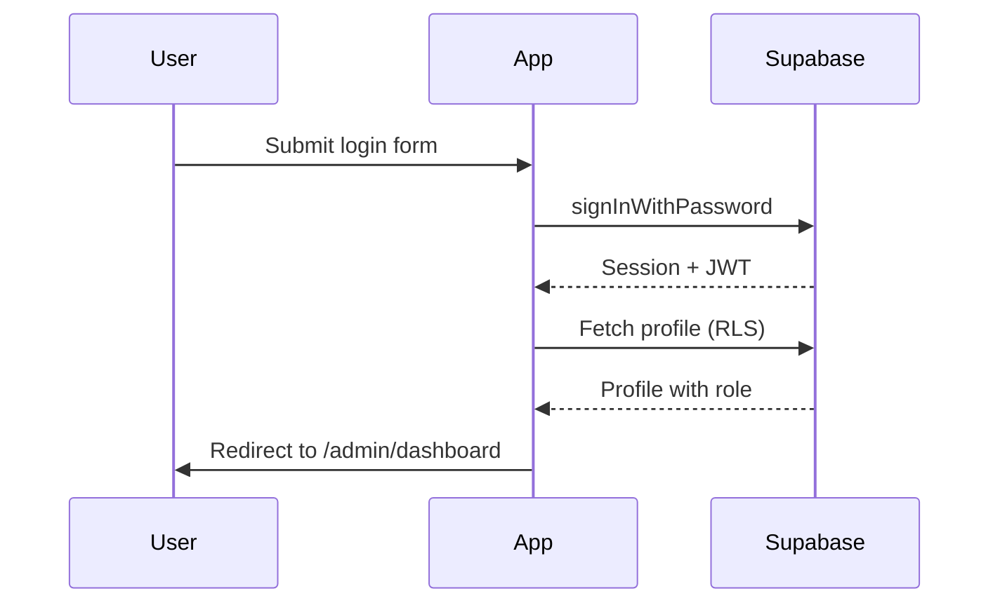

# Authentication

## Provider

Supabase Auth with email/password. Session persisted in browser via `@supabase/supabase-js`.

## Flow

## Profile creation

On `auth.users` insert, trigger `handle_new_user()` creates a `profiles` row with default role `editor`.

## Roles

Stored in `profiles.role`. Checked via:

- **Frontend**: `ProtectedRoute`, `useAuth().hasRole()`
- **Backend**: RLS function `has_role(required_roles[])`

## Route protection

| Route pattern | Requirement |
|---------------|-------------|
| `/admin/login` | Public |
| `/admin/*` | Authenticated + active profile |
| `/admin/users` | `super_admin` only |

## Session refresh

Handled automatically by Supabase client (`autoRefreshToken: true`).

## Sign out

Calls `supabase.auth.signOut()` and clears local profile state.

## Security notes

- Never expose `service_role` key in frontend
- Only `VITE_SUPABASE_ANON_KEY` in client env
- Promote first user to `super_admin` via SQL (see DATABASE.md)
- Deactivated users (`is_active = false`) cannot access admin

## Future: Loft SSO

Document planned integration point in `AuthProvider` — replace `signInWithPassword` with Loft OAuth when available.
