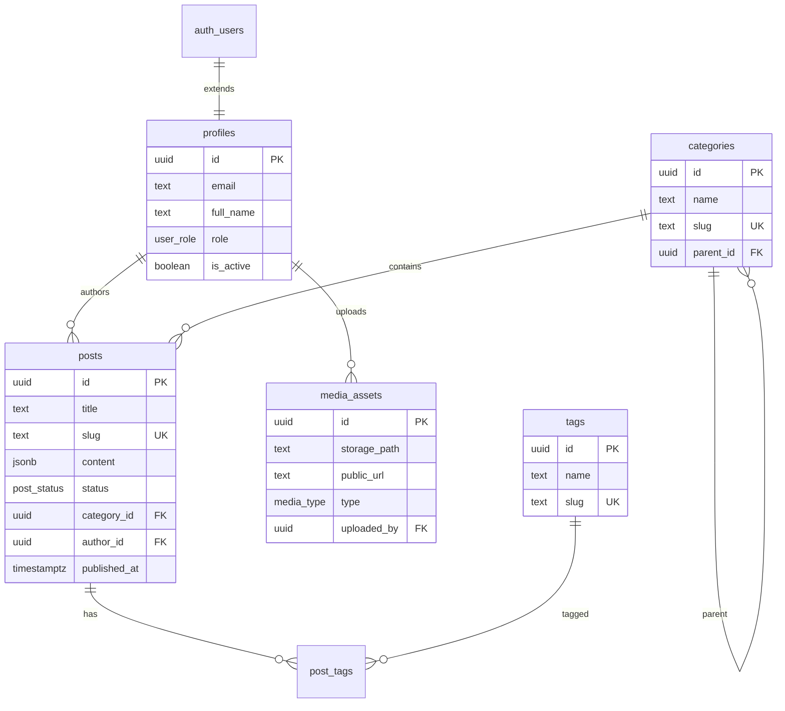

# Database

## ER Diagram



## Enums

- `user_role`: `super_admin`, `editor`, `viewer`
- `post_status`: `draft`, `published`, `archived`
- `media_type`: `image`, `video`, `document`

## Content format

Post `content` column stores **TipTap JSON** (ProseMirror document). Example:

```json
{
  "type": "doc",
  "content": [
    { "type": "paragraph", "content": [{ "type": "text", "text": "Hello" }] }
  ]
}
```

## Indexes

| Table | Index | Purpose |
|-------|-------|---------|
| posts | status, slug, published_at | Listing and lookup |
| posts | GIN full-text (portuguese) | Search on title + excerpt |
| categories | slug | Public category pages |
| media_assets | type, uploaded_by | Media library filters |

## RLS summary

- **Published posts**: readable by `anon`
- **Draft/archived posts**: readable by authenticated roles only
- **Write operations**: `super_admin` and `editor` only
- **User management**: `super_admin` only
- **Profiles**: users update own record; admins manage all

## Migrations

Location: `supabase/migrations/`

Apply via Supabase CLI:

```bash
supabase db push
```

Or paste SQL into Supabase Dashboard → SQL Editor.

## First admin user

After signing up via the app or Supabase Auth:

```sql
UPDATE profiles
SET role = 'super_admin'
WHERE email = 'your-email@company.com';
```

## Seed data

Run `supabase/seed.sql` for sample categories and tags.
